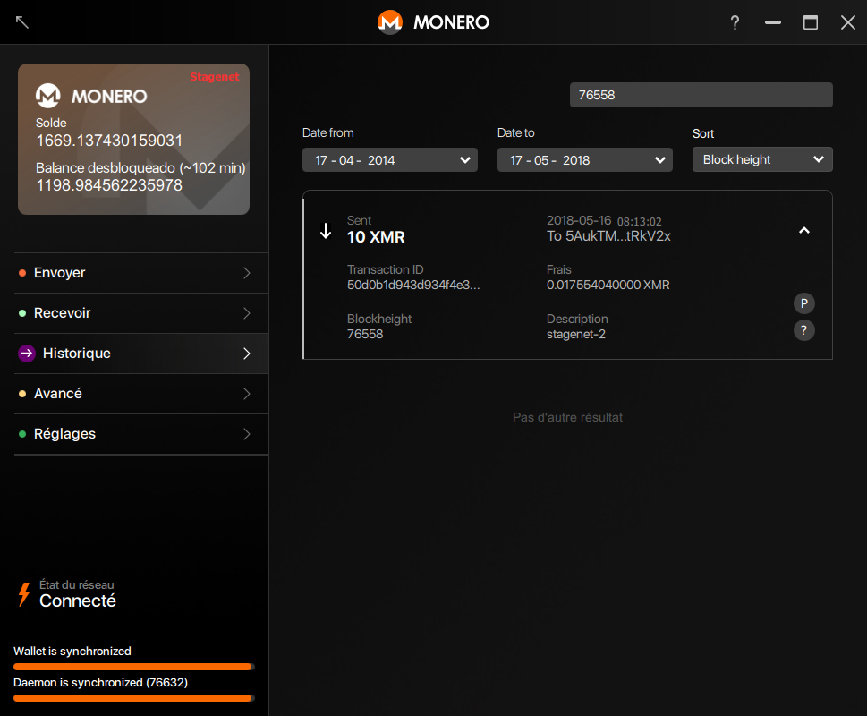
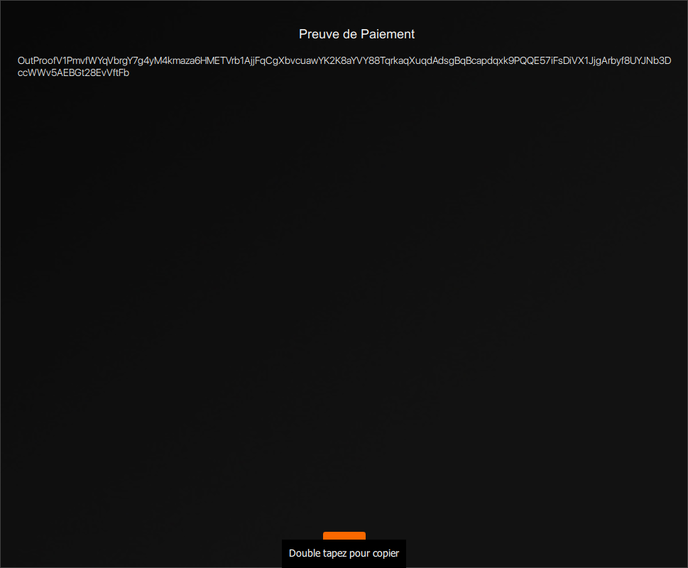
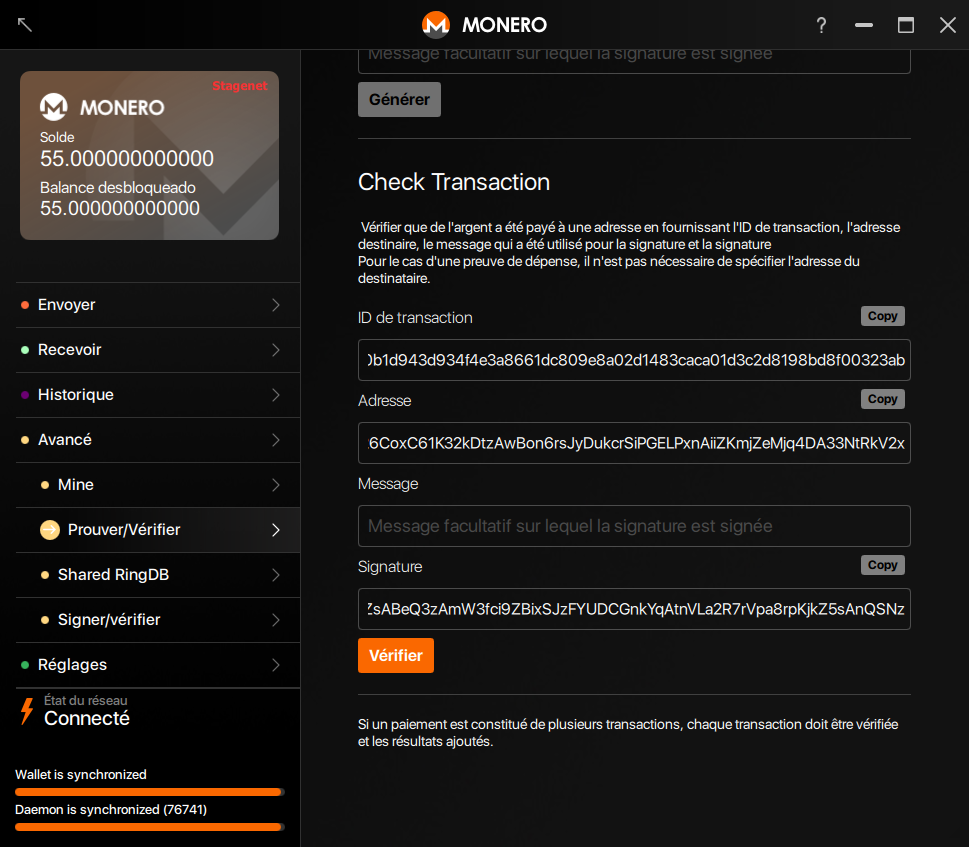
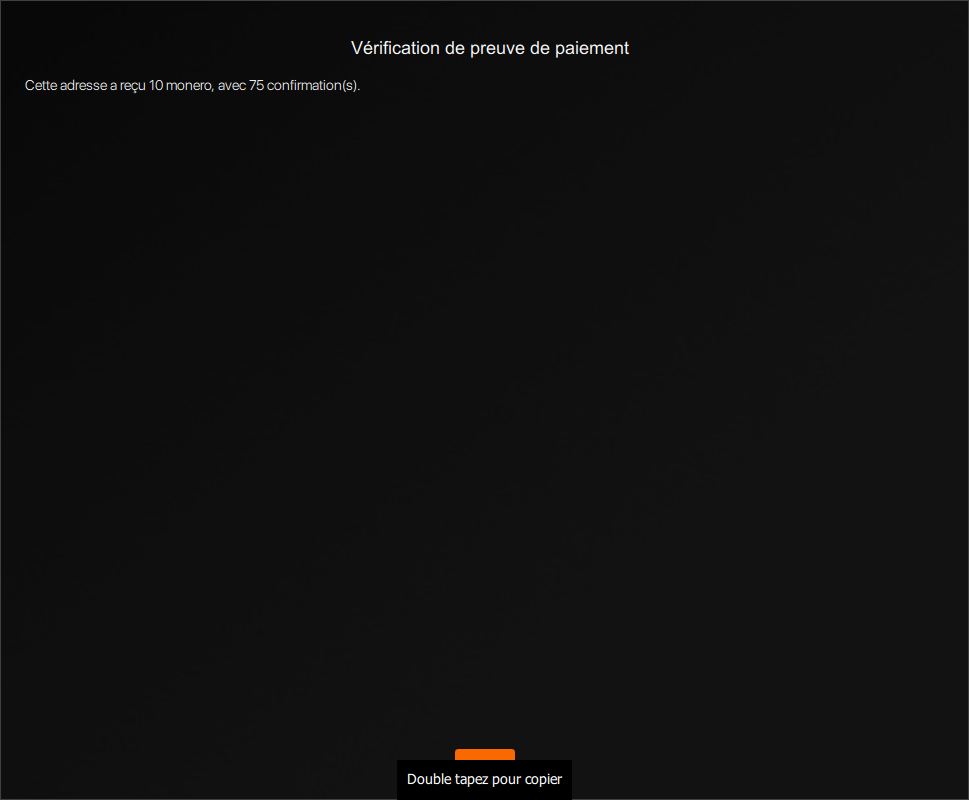

### Prouver un paiement

Lorsque vous envoyez un paiement à une partie qui conteste qu'il ait été effectué, vous devez pouvoir prouver qu'il a bien été effectué.

Avec Bitcoin, cela est généralement fait en recherchant l'ID de transaction, où les adresses d'origine et de destination sont
visibles, accompagnées du montant de la transaction.

Monero cependant est confidentiel : cette information n'est pas disponible publiquement sur la chaîne de blocs. Les étapes sont donc
un peu plus complexes.

Pour prouver à Charlie qu'elle a payée Bob, Alice doit fournir à Charlie ces données :

- L'ID de transaction, comme c'est le cas avec Bitcoin ;
- L'adresse de Bob, comme c'est le cas avec Bitcoin ;
- La clef de la transaction, qui est une nouveauté de Monero et d'autres monnaies CryptoNote.

Lorsqu'Alice a réalisé la transaction, une clef à usage unique a été automatiquement générée pour cette unique transaction.

#### CLI

Alice peut la demander dans monero-wallet-cli (nouveau nom de l'ancien simplewallet) :

> get_tx_key IDTX

Alice va indiquer son ID de transaction en lieu et place de ce IDTX. Une fois fait, la clef de transaction à usage unique
sera affichée.

Notez que cela ne fonctionnera que si monero-wallet-cli est configuré pour sauvegarder les clefs de transaction. Pour le vérifier :

> set

Si la valeur est fixée à 0, positionnez-la à 1 :

> set store-tx-info 1

#### GUI

Alice peut ouvrir son monero-wallet-gui et aller à la page historique pour voir les détails de la transaction :

Ici, elle peut copier l'ID de transaction et l'adresse de Bob en cliquant sur chacun d'eux.
Puis elle peut cliquer sur `P` pour obtenir une preuve de paiement (clef de transaction) :

---

Alice peut maintenant envoyer la clef de transaction à Charlie avec l'ID de transaction et l'adresse de Bob.

Notez : si plusieurs transactions ont été effectuées, il faudra répéter l'opération pour chacune de ces transactions.

### Vérifier un paiement

Charlie a maintenant reçu les trois données et veut vérifier qu'Alice dit la vérité à Bob : sur une chaîne de blocs à
jour,

#### CLI

Charlie entre dans monero-wallet-cli :

> check_tx_key IDTX CLEFTX ADRESSE

Les données fournies par Alice entrées en lieux et place de leurs identifiants respectifs. monero-wallet-clu va se servir
de la clef de transaction pour décoder la transaction et afficher quel montant a été envoyé à cette adresse pour cette
transaction spécifique.

#### GUI

Charlie ouvre son monero-wallet-gui et va à la page Avancé > Prouver/vérifier afin de remplir la section Vérifier avec les éléments transmis par Alice :

Puis cliquer sur Vérifier indiquera à Charlie combien a été envoyé à cette adresse pour cette transaction spécifique et combien de confirmation la transaction a eu :

---

Évidemment, Charlie voudra vérifier si l'adresse de Bob est bien la sienne, comme avec Bitcoin.

Notez : si plusieurs transactions ont été effectuées, il faudra répéter l'opération pour chacune de ces transactions.

