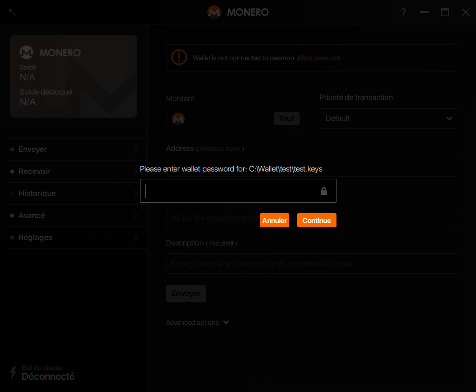
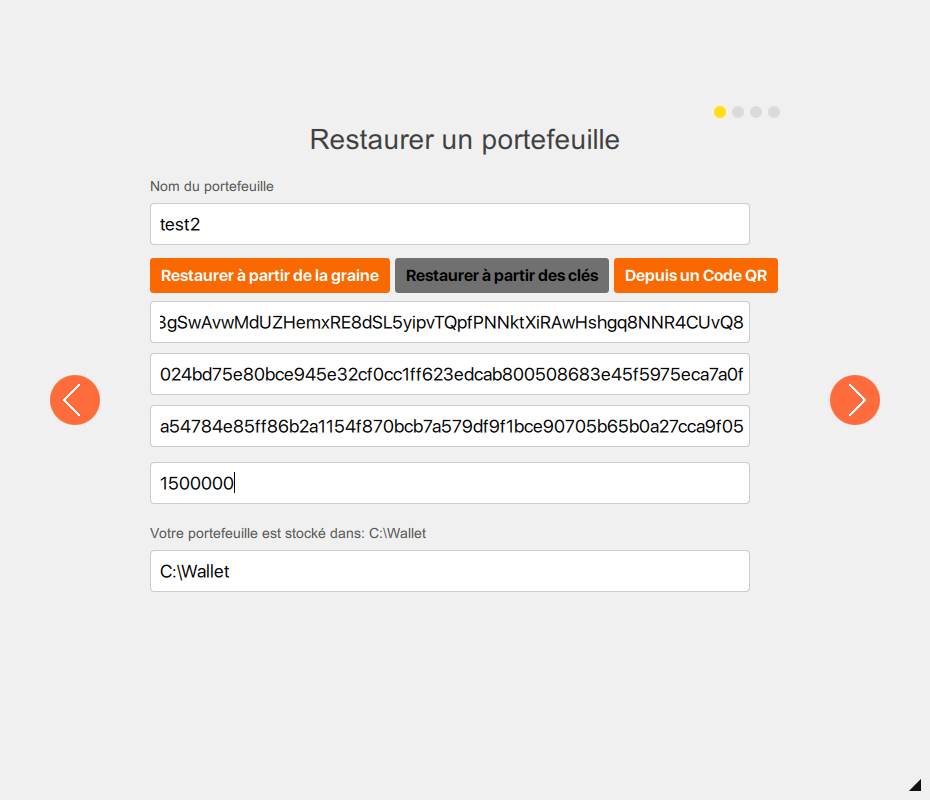
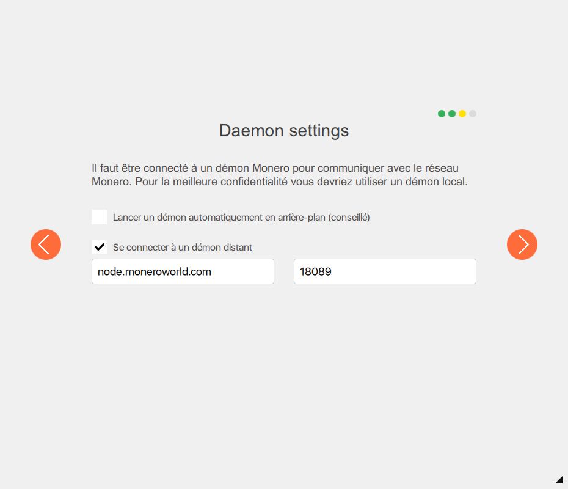
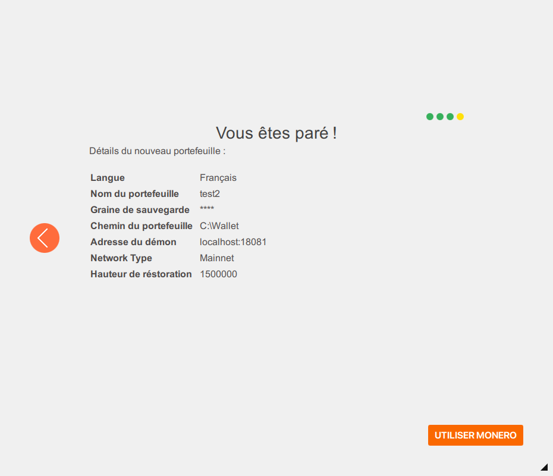



## Systèmes d'exploitation : Windows, Linux, Mac

- Récupérez votre @mnemonic-seed de 25 mots que vous avez sauvegardé lorsque vous avez créé votre ancien @wallet Monero ;

### Application de comptabilité :  monero-wallet-cli

- Ouvrez une invite de commande et naviguez sur le disque et dans le répertoire contenant monero-wallet-cli ;

- Dans l'invite de commande, tapez :  `monero-wallet-cli --restore-deterministic-wallet` ;

- Une fois que vous aurez appuyé sur la touche Entrée, un nom de portefeuille vous sera demandé. Donnez le nom de votre choix au portefeuille ;

- Appuyez de nouveau sur la touche Entrée afin que le mot de passe vous soit demandé. Fournissez un nouveau et long mot de passe ;

- Appuyez de nouveau sur la touche Entrée et répéter votre mot de passe ;

- Appuyez de nouveau sur la touche Entrée saisissez les 25 mots type electrum de votre phrase mnémonique que vous avez récupéré plus tôt ;

- On vous demandera alors la hauteur de bloc de restauration "Restore from specific blockchain height (optional, default 0):" La valeur par défaut lancera le processus de restauration à partir du début de la chaîne de blocs. Si vous ne connaissez pas la hauteur de bloc spécifique, appuyez simplement sur la touche Entrée. (Spécifier une hauteur de bloc lancera le processus de restauration à partir de cette hauteur spécifique. Cela évitera un peut de temps d'analyse si vous savez à partir de quelle hauteur de bloc vos fonds initiaux ont été transféré pour ce compte)

Après avoir saisit les 25 mots de la phrase mnémonique et avoir choisit la hauteur de bloc, monero-wallet-cli va généré la même adresse publique et clef d'audit que pour votre ancien portefeuille et commencera le processus de rafraîchissement automatiquement. (Soyez patient car le processus de rafraichissement peut être long)

### Application de comptabilité :  monero-wallet-gui

Lancez `monero-wallet-gui`. Si c'est la première fois que vous le lancez, allez directement à l'étape suivante, sinon, cliquez sur `Cancel` :

Choisissez votre langue `Français`:

Cliquez sur `Restaurer un portefeuille à partir des clés ou de la phrase mnémonique`:

Conservez `Restaurer à partir de la graine` sélectionné, donnez un nom & un emplacement de stockage à votre portefeuille, complétez `Enter your 25 (or 24) word mnemonic seed`. Optionnellement, indiquez une `Hauteur de restauration (facultative)` pour éviter de scanner les blocs les plus anciens. Enfin cliquez sur la flèche `Droite` :

Sur la page suivante, donnez un mot de passe fort à votre portefeuille avant de cliquer sur la flèche `Droite` :

Indiquez vos paramètres de démon, et cliquez sur la flèche `Droite` :

Cliquez sur `UTILISER MONERO` pour profiter de votre portefeuille restauré :

